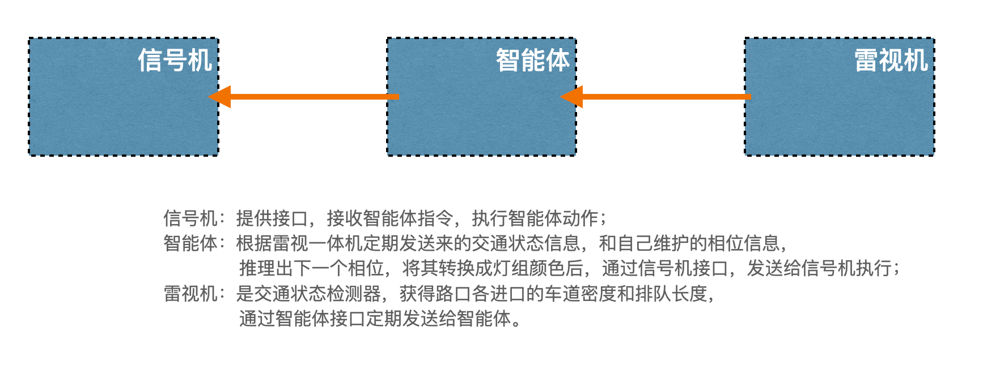

# 程序说明



根据附件图，设计3个独立运行于不同硬件上的服务。
- 信号机服务使用Rust编写，模拟信号机逻辑；
- 雷视机使用Rust编写，模拟交通状态检测器逻辑；
- 智能体使用Python编写，接收雷视机发送来的交通状态信息，调用预训练的强化学习模型，推理下一个信号相位，转换成灯组颜色后，发送给信号机执行。
- 三个服务之间采用socket通信方式。

## 项目位置

```
workspace------signal-controller
          |
          -----traffic-detector
          |
          -----smart-agent
```

## 信号机服务：signal-controller

项目依赖库Cargo.toml:
``` 
[package]
name = "signal-controller"
version = "0.1.0"
edition = "2021"

[dependencies]
tokio = { version = "1.0", features = ["full"] }
serde = { version = "1.0.218", features = ["derive"] }
serde_json = "1.0.139"
lazy_static = "1.4.0"

[build-dependencies]
```

## 雷视机服务: traffic-detector
``` 
[package]
name = "traffic-detector"
version = "0.1.0"
edition = "2021"

[dependencies]
tokio = { version = "1.0", features = ["full"] }
serde_json = "1.0.139"
serde = { version = "1.0.218", features = ["derive"] }
chrono = "0.4.40"

[build-dependencies]
```

## 智能体服务: smart-agent

本应用服务。

## 运行服务

- 运行信号机服务(50051): ``` cargo run```
- 运行雷视机服务(50052)：``` cargo run```
- 运行智能体服务(50053)：``` python main.py```

## 测试程序：test_client.py

运行测试程序：```python test_client.py```

- 连接到雷视机服务获取交通状态
- 将交通状态发送给智能体服务获取控制指令
- 将控制指令发送给信号机执行

## 在ubuntu上创建自启动服务

``` 
sudo nano /etc/systemd/system/smart_agent.service

------
[Unit]
Description=Smart Agent Startup
After=network.target

[Service]
User=cyatc
Group=cyatc
WorkingDirectory=/home/cyatc/smart-agent
ExecStart=/bin/bash -c 'source venv/bin/activate && python3 main.py'
Restart=always
RestartSec=5
StandardOutput=append:/home/cyatc/smart-agent/out-logs.log
StandardError=append:/home/cyatc/smart-agent/error-logs.log

[Install]
WantedBy=multi-user.target

-----
sudo systemctl daemon-reload
sudo systemctl enable smart_agent  # 设置开机自启动
sudo systemctl disable smart_agent  # 关闭开机自启动
sudo systemctl start smart_agent  # 启动服务
sudo systemctl stop smart_agent  # 停止服务
sudo systemctl status smart_agent  # 查看状态

# 查看日志
cat /home/cyatc/smart-agent/out-logs.log
cat /home/cyatc/smart-agent/error-logs.log

```

## 结果分析
``` 
📥 收到控制指令:GGGGGGrrrrrrrrrrrrrGGGGGGrrrrrrrrrrrrrr (上条指令: 0.12秒) --1
📥 收到控制指令:GGGGGGrrrrrrrrrrrrrGGGGGGrrrrrrrrrrrrrr (上条指令: 2.89秒) --2
📥 收到控制指令:yyyyyyrrrrrrrrrrrrryyyyyyrrrrrrrrrrrrrr (上条指令: 87.86秒)--3
📥 收到控制指令:rrrrrrGGGGrrrrrrrrrrrrrrrGGGGrrrrrrrrrr (上条指令: 3.17秒) --4
📥 收到控制指令:yyyyyyrrrrrrrrrrrrryyyyyyrrrrrrrrrrrrrr (上条指令: 3.17秒) --5
📥 收到控制指令:rrrrrrGGGGrrrrrrrrrrrrrrrGGGGrrrrrrrrrr (上条指令: 3.20秒) --6
📥 收到控制指令:rrrrrryyyyrrrrrrrrrrrrrrryyyyrrrrrrrrrr (上条指令: 2.76秒) --7
📥 收到控制指令:rrrrrryyyyrrrrrrrrrrrrrrryyyyrrrrrrrrrr (上条指令: 3.02秒) --8
📥 收到控制指令:rrrrrrrrrrrrrrrrGGGrrrrrrrrrrrrrrrrGGGG (上条指令: 0.00秒) --9
📥 收到控制指令:rrrrrrrrrrrrrrrrGGGrrrrrrrrrrrrrrrrGGGG (上条指令: 3.12秒) --10
📥 收到控制指令:rrrrrrrrrrrrrrrryyyrrrrrrrrrrrrrrrryyyy (上条指令: 2.87秒) --11
📥 收到控制指令:rrrrrrrrrrrrrrrryyyrrrrrrrrrrrrrrrryyyy (上条指令: 3.01秒) --12
📥 收到控制指令:rrrrrrrrrrGGGGGGrrrrrrrrrrrrrGGGGGGrrrr (上条指令: 0.00秒) --13
📥 收到控制指令:rrrrrrrrrrGGGGGGrrrrrrrrrrrrrGGGGGGrrrr (上条指令: 3.01秒) --14
```

- 第1,2两条是南北直行，相同相位执行了两次，不正确；
- 第4条是南北左转，从第5条上看出，南北左转只执行了3.17秒，没有达到最小绿，不正确；
- 第7，8两条，第11，12两条都是黄灯相位，不应该执行两次，虽然执行时间长度只有3秒是正确的；
- 第5条黄灯只执行一次，是正确的；